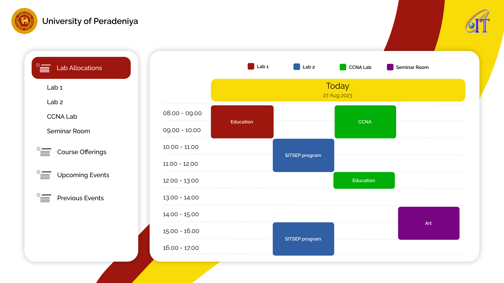
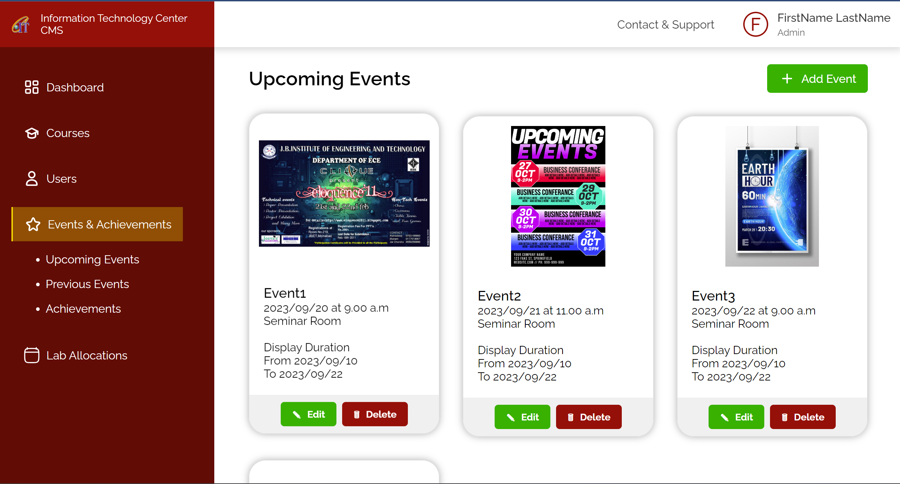

[comment]: # "This is the standard layout for the project, but you can clean this and use your own template"

# Digital Signage Content Management System

---

<!-- 
This is a sample image, to show how to add images to your page. To learn more options, please refer [this](https://projects.ce.pdn.ac.lk/docs/faq/how-to-add-an-image/)

 -->

## Team
-  E/19/090, Dissanayke D.M.I.G., [email](mailto:e19090@eng.pdn.ac.lk)
-  E/19/309, Rambukwella H.M.W.K.G., [email](mailto:e19309@eng.pdn.ac.lk)
-  E/19/436, Wickramasingha G.T.G., [email](mailto:e19436@eng.pdn.ac.lk)
-  E/19/446, Wijerathna I.M.K.D.I., [email](mailto:e19446@eng.pdn.ac.lk)

## Table of Contents
1. [Introduction](#introduction)
2. [Other Sub Topics](#other-sub-topics)
3. [Links](#links)

---

## Introduction

Welcome to our Digital Signage Content Management System (CMS) project, where we're redefining the way you engage with digital screens. Our innovative CMS bridges technology and communication to transform information delivery into an immersive and dynamic experience.

**Solving Real-World Problems**: In an era driven by digitalization, conveying information effectively and engagingly has become paramount. We recognized this need and set out to create a solution that seamlessly manages and displays content on various digital screens. Our Digital Signage CMS is here to revolutionize communication.

**Impact**: Our CMS empowers organizations to efficiently manage and schedule content for public displays. Whether you're a university scheduling lab slots, a business promoting its products, or an event organizer, our CMS simplifies content management, enhancing engagement and interaction.

1. 

2. 

## Lab Slots and Hours

### Overview

Bring lab schedules to life with real-time updates, ensuring optimal resource utilization.

### Features

- **Dynamic Display**: Showcase lab slots and hours dynamically.
- **Real-Time Updates**: Stay updated with real-time changes.
- **Interactive Filters**: Personalize your view with interactive filters.

## Course Offerings

### Overview

Explore a world of courses offered by our IT Center, designed to kickstart your academic journey.

### Features

- **Immersive UI**: Discover courses through an immersive user interface.
- **Dynamic Data**: PHP and MySQL synergy for dynamic data display.
- **Tailored Exploration**: Search and filter options for personalized discovery.

## Advertisements - Upcoming Events

### Overview

Experience anticipation as information comes to life through visually captivating event advertisements.

### Features

- **Flair and Style**: Display event advertisements with flair.
- **Backend Control**: PHP backend for content scheduling.
- **Enhanced Engagement**: Animations and visuals enhance user experience.

## Posters - Previous Events/Achievements

### Overview

Celebrate achievements and relive memories that shape our IT Center's story through a gallery-style presentation of posters.

### Features

- **Gallery-Style**: Present posters in a gallery-style layout.
- **Backend Management**: Empowerment for uploading and management.
- **Asset Security**: Secure handling of poster assets.

## Login System

### Overview

Kickstart your journey with an authentication gateway, granting access to administrators and course coordinators.

### Features

- **User Roles**: Differentiate user roles: admin and course coordinator.
- **Content Protection**: Secure content management and scheduling.

## Display Scheduling Process

### Overview

Discover the orchestration behind scheduling and displaying content across digital screens and smart boards.

### Steps

1. **Administrator Login**: Access the CMS dashboard.
2. **Content Selection**: Choose content type: lab schedules, course offerings, advertisements, or posters.
3. **Scheduling**: Set start and end times for content.
4. **Backend Logic**: CMS backend manages scheduling.
5. **Content Display**: Content appears on screens at scheduled times.
6. **Real-Time Updates**: Dynamic updates ensure real-time changes are reflected.

## Conclusion

Our Digital Signage CMS presents a canvas of innovation and communication, redefining engagement in the digital age. Explore each feature's unique facets and embrace the fusion of technology and interaction that defines our project.

---

## Links

- [Project Repository](https://github.com/cepdnaclk/{{ page.repository-name }}){:target="_blank"}
- [Project Page](https://cepdnaclk.github.io/{{ page.repository-name}}){:target="_blank"}
- [Department of Computer Engineering](http://www.ce.pdn.ac.lk/)
- [University of Peradeniya](https://eng.pdn.ac.lk/)

[//]: # (Please refer this to learn more about Markdown syntax)
[//]: # (https://github.com/adam-p/markdown-here/wiki/Markdown-Cheatsheet)
